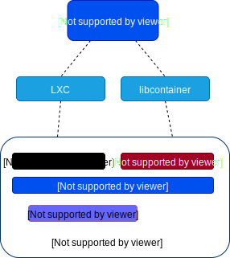
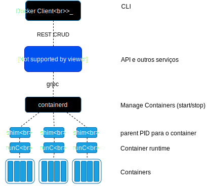

name: splash
layout: true
class: center, middle, inverse

---
count:false
# Docker - Infraestrutura imutavel

# by [@famsbh](http://twitter.com/famsbh)

---
layout: true
name: sessao
class: left, center, inverse
#.logo-linux[]

---
layout: true
name: conteudo
class: left, top
.logo-linux[]

---
template: conteudo

# Agenda


### Dia 2
 - Docker Compose
 - Docker network
 - Docker Volumes
 - Docker Security

---


# Comunicação entre containers
 - EXPOSE
 - \-p
 - docker create network

# Iniciando containers intergrados
```bash
$ docker network create curso
$ docker run -d --network curso --name redis redis -v ./redis-data:/data
$ docker run -d --network curso --name contador -p 5000:5000 contador
```

---
# Gerenciando multiplos containers com docker-compose
- Um arquivo de configuração para todo o ambiente
- Define todo o ambiente do Dockerfile para serem reproduzíveis
- Define os serviços de um container para executarem em um abiente isolado
- Gerencia o ciclo de vida de todos os containers descritos

---
# docker-compose.yaml
```yaml
version: '3'
services:
  contador:
    image: "fams/contador:latest"
    ports:
     - "5000:5000"
    networks:
      - contador

  redis:
    image: "redis:latest"
    command: ["redis-server", "--appendonly", "yes"]
    volumes:
      - ./redis-data:/data
    networks:
      - contador

networks:
  contador:
```

---
# docker-compose volumes
```yaml
version: '3'
services:
  redis:
  ...
    volumes:
      - ./redis/redis.conf:/usr/local/etc/redis/redis.conf
      - redis-data:/data
...
volumes:
  redis-data:
```

---
template: splash


# Docker Containers Internals
### Entendendo de verdade

---
template: conteudo
# Componentes

- Docker client
- Docker daemon
- containerd
- runc
- shim
- docker HUB

---

# Docker container Model

.full-image-height[]

---

# Docker container Model

.full-image-height[]

---

# Docker Client

- cmdline
- comunica com o Daemon por CRUD REST
- comunicacão tcp, socket
- tls security
- auth plugins

---

# Docker Daemon
- Serve a API
- network services
- comunicação com o mundo
- Acesso ao Docker HUB
- REST com client
- GRPC com containerd

---

# containerd
- Parte da estratégia de remover codigo do daemon
- Gerencia o ciclo de vida do container (start, stop, pause)
- Gerencia as imagens (prepara para o runc)
- OCI

---

# runc
- implementação de wrapper para  libcontainer
- especificacão OCI
- Morre após a carga
- Problema de segurança em 2019

--
### shim
 - captura stdin, stdout dos processos
 - permite os containers funcionarem detached

---
# Internals CGROUPS

- Hierarquias
 - CPU
 - Memory
 - blkio
 - devices

---
# Namespaces
.full-image[]

---

# Namespaces
 - pid
 - net
 - mnt
 - uts
 - ipc
 - user

---

# Drop Privileges/Security
- AppArmor
- Selinux
- CAP_ADMIN

---

# Docker Images
- Dockerfile
- imagens em camadas
- docker HUB
- imagens oficiais

---

template: splash

# Docker Containers Network
### interligando containers

---
template: conteudo

# Visão geral de rede no Docker

- Conteiners precisam falar com o mundo
- Conteiners proveem serviços, o mundo precisa falar com eles
- Conteiners precisam falar uns com os outros
  - Localmente
  - Entre Hosts
- Como fazer descoberta de serviços providos pelos containers
- Load Balance

???
 - Nework Brige
 - Publish port
 - Networks, drivers
 - DNS
 - Load Balance

---

# Visão Geral Rede Docker

- docker run -p
- docker container port
- Just Works (DEV/STAGE)

???
 - expoe porta do host
 - Mostra portas expostas no HOST
 - Baterias inclusas mas removiveis

---

# Padrão de rede no Docker

 - Conectar em uma rede bridge padrão (docker0)
 - Redebe IP da rede padrão e acessa o mundo por NAT do host
 - Podem acessar uns aos outros sem o -p
 - Melhor prática criar uma rede propria

---

# Comandos Rede

- Listar redes: docker network ls
- Descrever rede: docker network inspect <NOME/ID>
- Criar rede: docker netwrok create --driver
- Conectar container à rede: docker network connect
- Desconectar container à rede: docker network disconnect

---

#LAB
 - Criar uma rede
 - Subir um container nessa rede
 - Listar informação da rede
 - anexar a rede a outro container
 - retirar rede do container.
 - acessar um container pelo outro, por ip e  por nome

---

# DNS RR
 - Balanceamento por DNS
 - Implementado pelo daemon
 - --net-alias <ALIAS>

---
# LAB DNS RR
- Criar dois containers NGINX com o mesmo net-alias
- Executar um container BASH e testar a resolução de nomes

---
# Network More

- Bridge
- Host
- Overlay
- Macvlan
- None
- Plugins

---
# CNM

.full-image-height[![Container Network Model][cnm]]
[cnm]: /img/cnm.png "Container Network Model"

---
#Host Driver
.full-image-height[![Host Networkl][host-driver]]
[host-driver]: /img/host-driver.png "Host Driver"

---
# Bridge
.full-image-height[![Bridge Networkl][bridge-driver]]
[bridge-driver]: /img/bridge-driver.png "Bridge Driver"

---
# Bridge
.full-image-height[![Bridge Networkl][bridge2]]
[bridge2]: /img/bridge2.png "Bridge Driver"

---
# Acesso Externo
.full-image[![External Access][nat]]
[nat]: /img/nat.png "External Access"

---

template: splash

# Docker Storage
### salvando dados

---
template: conteudo

#Docker StorageDriver

- AUFS
- OVERLAYFS
- Outros (zfs,vfs,devicemapping)

---

# Union FS

.full-image-height[![Layers][layer-container]]
[layer-container]: img/container-layers.jpg "Container Layers"

---
# Sharing Layers
.full-image-height[![sharing-layers][sharing-layers]]
[sharing-layers]: img/sharing-layerss.jpg "Compartilhando Camadas"

---

# docker history

```bash
IMAGE               CREATED             CREATED BY                                      SIZE                COMMENT
c91d8abdd65d        46 hours ago        /bin/sh -c #(nop)  ENTRYPOINT ["python3" "-m…   0B
fdaa2038bdc1        46 hours ago        /bin/sh -c #(nop) WORKDIR /var/www/html         0B
a6af0cd8ec20        46 hours ago        /bin/sh -c apt-get update -y && apt-get inst…   58.1MB
27b2f3b8a1a9        46 hours ago        /bin/sh -c #(nop)  EXPOSE 80                    0B
5aa63ecc9851        46 hours ago        /bin/sh -c #(nop) COPY dir:da83f9bd653600281…   5.01MB
053f5af46e6a        4 days ago          /bin/sh -c #(nop)  LABEL mantainer=fams@linu…   0B
9361ce633ff1        2 weeks ago         /bin/sh -c #(nop)  CMD ["/bin/bash"]            0B
<missing>           2 weeks ago         /bin/sh -c mkdir -p /run/systemd && echo 'do…   7B
<missing>           2 weeks ago         /bin/sh -c rm -rf /var/lib/apt/lists/*          0B
<missing>           2 weeks ago         /bin/sh -c set -xe   && echo '#!/bin/sh' > /…   745B
<missing>           2 weeks ago         /bin/sh -c #(nop) ADD file:c02de920036d851cc…   118MB
```

---
# docker inspect

```bash
....
        "GraphDriver": {
            "Data": {
                "LowerDir": "/var/lib/docker/overlay2/0ac0ccecb9db55bc437bbcb1b6415cb0f7894d9f2f9f5d1dc638864355c73527/diff:/var/lib/docker/overlay2/1adc65d03092b5311b0ffa47c8ff2c9e6305fcc519bad184ba2b853447daf6ab/diff:/var/lib/docker/overlay2/05f07100fd62dec715148930a61e860e03e16416d406fe430f75ca0821166544/diff:/var/lib/docker/overlay2/482336a2284a8e36ae414a09cff7cd7b19b568036e20d39a2f94b63424cc856e/diff:/var/lib/docker/overlay2/2884ef4ca82a3cb86d922baed157777ed0b531b1a0e540a2e382e1296773e8d2/diff",
                "MergedDir": "/var/lib/docker/overlay2/ca6605593282b550e58b205634a6b4a5d5f1a19d0a0918a89d857b17fbea44fb/merged",
                "UpperDir": "/var/lib/docker/overlay2/ca6605593282b550e58b205634a6b4a5d5f1a19d0a0918a89d857b17fbea44fb/diff",
                "WorkDir": "/var/lib/docker/overlay2/ca6605593282b550e58b205634a6b4a5d5f1a19d0a0918a89d857b17fbea44fb/work"
            },
            "Name": "overlay2"
        },
...
```

---

# overlayfs
.full-image-height[![Overlay][overlay]]
[overlay]: img/overlay_constructs.jpg "Overlay"

---

#Volumes
- Volumes não são camadas!
- Não armazene dados no container
- Não armazene logs no container

---
# Shared Storage (no mesmo host)
- Volume do storage
```bash
$ docker volume create mydata
$ docker run -it --rm -v mydata:/mnt busybox bash
$ docker run -it --rm -v mydata:/mnt busybox bash
```

---
# NFS
- Compartilhado na rede

```bash
$ docker volume create --opt nfs type=nfs \
  --opt o=addr=192.168.0.5,rw  \
  --opt device=:/volume1/docker \
  nfs
```

---

#Plugins
- Extende o docker daemon
- Multiplos vendors
- Instalação do plugin no host, docker create, profit

---
# Plugins Ex:
- iscsi
- ebs
- ceph
- nutanix
- purestorage
- GlusterFS
- vmdk
- ...

---
#Nutanix Plugin!
- Preparação do Host
1. apt-get install open-iscsi
2. systemd-tmpfiles --create
3. systemctl start iscsid
4. systemctl enable iscsid
5. Ensure iscsid is running using: systemctl status iscsid

---
# Instalando o plugin
```bash
docker plugin install ntnx/nutanix_volume_plugin:[TAG] \
  PRISM_IP="prism-ip" \
  DATASERVICES_IP="dataservices-ip" \
  PRISM_PASSWORD="prism-passwd" \
  PRISM_USERNAME="username" \
  DEFAULT_CONTAINER="some-storage-container" \
  --alias nutanix
```

#Criando o volume
```bash
docker volume create <volume_name> \
 --driver nutanix \
 --opt sizeMb=size
```

---
